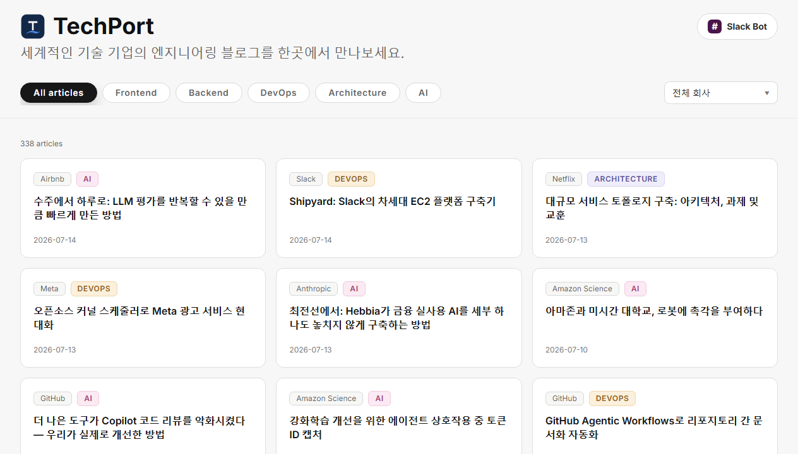
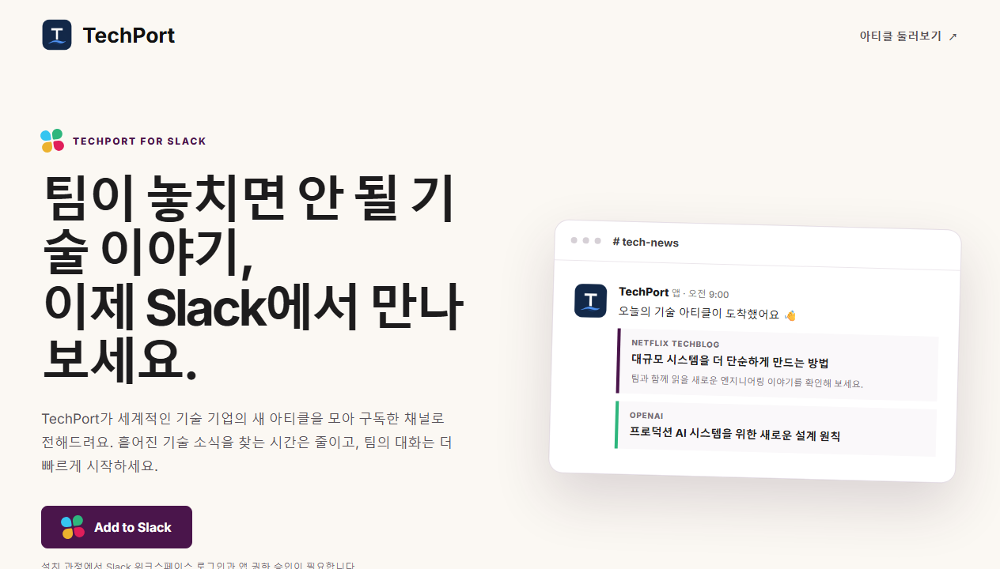
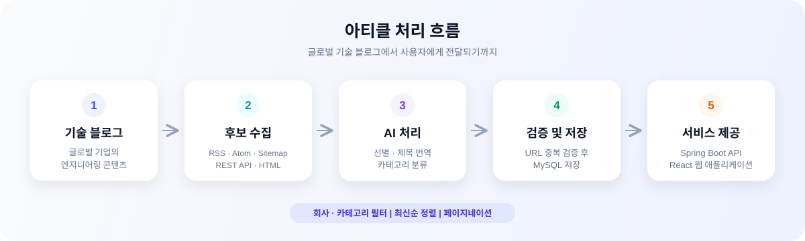
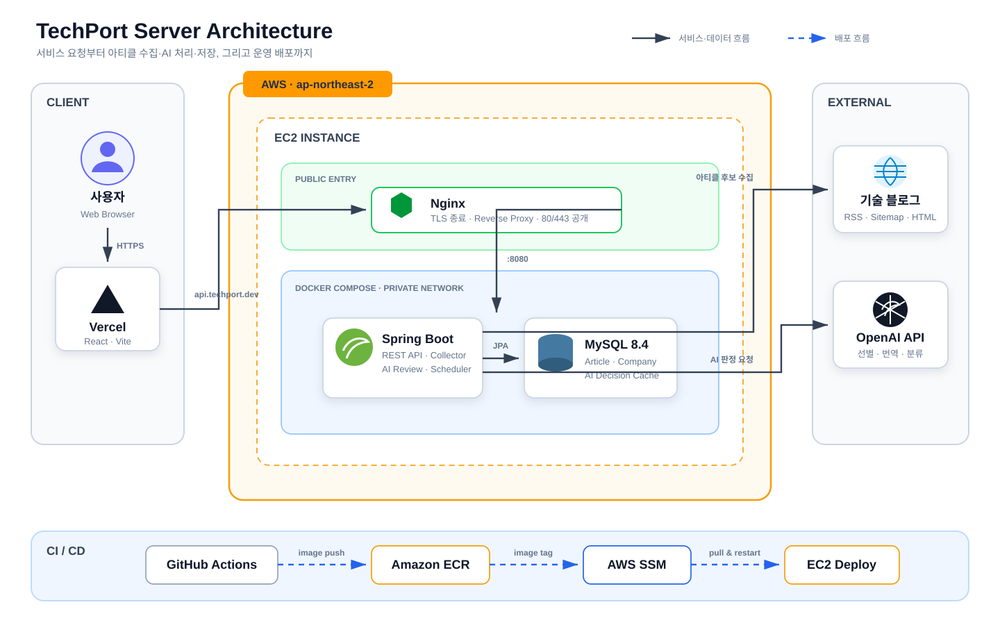

# [TechPort](https://www.techport.dev/)

> 글로벌 기술 기업의 엔지니어링 인사이트를 한곳에서 탐색하세요.

OpenAI, Netflix, Meta, GitHub 등 여러 기업의 엔지니어링 블로그를 자동으로 수집하고,
AI로 기술 아티클을 선별·번역·분류해 웹과 Slack으로 제공하는 아카이브 서비스입니다.

<p align="center">
  <a href="https://www.techport.dev/"><strong>TechPort 둘러보기 →</strong></a>
  ·
  <a href="https://www.techport.dev/slack"><strong>Slack Bot 추가하기 →</strong></a>
</p>



## 왜 만들었나요?

글로벌 기술 기업은 실제 서비스에서 마주한 문제와 아키텍처 결정, 운영 경험을
엔지니어링 블로그에 꾸준히 공유합니다. 하지만 글이 여러 사이트에 흩어져 있고,
관심 분야의 기술 글만 골라 살펴보려면 각 블로그를 반복해서 방문해야 합니다.
영문 제목만으로 글의 내용을 빠르게 파악하기도 쉽지 않습니다.

TechPort는 이 탐색 비용을 줄이는 데 집중했습니다.

| 불편함                                       | TechPort의 해결 방식                        |
| -------------------------------------------- | ------------------------------------------- |
| 여러 기업 블로그에 글이 흩어져 있음          | 다양한 형식의 소스에서 최신 글을 자동 수집  |
| 기술 글과 제품 소식이 섞여 있음              | AI가 개발자에게 유용한 기술 아티클만 선별   |
| 영문 제목만으로 내용을 파악하기 어려움       | 제목을 한국어로 번역해 제공                 |
| 관심 분야의 글을 찾기 번거로움               | 회사와 기술 카테고리별 필터 제공            |
| 새 글을 확인하려고 서비스를 반복 방문해야 함 | 구독한 기업의 새 아티클을 Slack 채널로 전달 |

## 핵심 기능

### 여러 형식의 기술 블로그 통합 수집

- RSS와 Atom을 우선 사용하고, 소스 특성에 따라 Sitemap, WordPress REST API,
  HTML 목록 페이지에서도 아티클을 수집합니다.
- OpenAI, Anthropic, Netflix, Figma, Meta, Uber 등 17개 기업의 기술 블로그를 지원합니다.
- 회사와 URL 해시의 조합으로 같은 아티클이 중복 저장되는 것을 방지합니다.

### AI 기반 선별·번역·분류

- 수집 후보가 개발자에게 유용한 기술 아티클인지 AI가 판정합니다.
- 승인된 글의 제목을 한국어로 번역하고 `Frontend`, `Backend`, `DevOps`,
  `Architecture`, `AI` 중 하나로 분류합니다.
- URL과 프롬프트 버전을 기준으로 AI 판정 결과를 저장해, 이미 검토한 글에 대한
  중복 호출을 줄입니다.

### 관심사에 맞춘 탐색

- 회사와 카테고리를 조합해 원하는 아티클만 필터링할 수 있습니다.
- 최신 발행일 순으로 글을 확인하고 페이지 단위로 탐색할 수 있습니다.
- 아티클 카드를 선택하면 해당 기업의 원문 기술 블로그로 이동합니다.

### Slack Bot 채널 구독과 Daily Digest

- TechPort Slack 앱을 워크스페이스에 설치하고, 알림을 받을 채널에서 `/subscribe`를 실행합니다.
- 구독 모달에서 관심 기업을 선택하면 워크스페이스와 채널별로 구독 설정을 저장합니다.
- 새로 저장된 아티클 중 채널이 구독한 기업의 글만 모아 회사별 Daily Digest로 발송합니다.
- Slack 요청 서명을 검증하고 Bot Token을 암호화해 보관하며, 일시적인 발송 실패는 재시도합니다.



## 처리 흐름



AI 검수를 통과한 아티클은 웹 아카이브에 노출됩니다. Slack Daily Digest는 채널별 구독 정보와
새 아티클을 조합해 메시지를 만들고 Slack Web API로 전달합니다.

## 기술 스택

| 영역           | 기술                                                            |
| -------------- | --------------------------------------------------------------- |
| Frontend       | React 19, TypeScript 5, Vite 6, Playwright                      |
| Backend        | Java 21, Spring Boot 3.5, Spring Data JPA, Spring Batch         |
| Database       | MySQL 8.4 LTS, Flyway                                           |
| External API   | OpenAI API, Slack API                                           |
| Infrastructure | AWS EC2, ECR, SSM, Docker Compose, Nginx, Let's Encrypt, Vercel |
| CI/CD          | GitHub Actions                                                  |
| Test           | JUnit 5, Spring Boot Test, Testcontainers, Playwright           |

## 아키텍처



프론트엔드는 Vercel에서 제공하고, API 요청은 AWS EC2의 Nginx를 거쳐
Spring Boot 애플리케이션으로 전달됩니다. Spring Boot와 MySQL은 동일한 EC2의
Docker Compose 내부 네트워크에서 통신하며 외부에는 Nginx만 공개합니다.

백엔드는 GitHub Actions에서 컨테이너 이미지를 빌드해 Amazon ECR에 저장하고,
AWS SSM을 통해 EC2에 배포합니다. 수집기는 외부 기술 블로그에서 아티클 후보를
가져오고, OpenAI API의 선별·번역·분류를 거친 결과를 저장합니다.

Slack 앱 설치는 OAuth 2.0으로 처리하고 워크스페이스의 Bot Token은 암호화해 저장합니다.
Spring Batch 기반 Daily Digest 작업은 채널별 기업 구독과 새 아티클을 조회해 메시지를 만들고,
Slack Web API를 통해 구독 채널에 전달합니다.

## 프로젝트 구조

```text
global-tech-blog-archive/
├── backend/                 # Spring Boot API, 아티클 수집, AI 분류, Slack 알림
│   ├── src/main/java/
│   ├── src/main/resources/  # 설정, 프롬프트, Flyway 마이그레이션
│   └── src/test/
├── frontend/                # React 웹 애플리케이션
│   ├── src/
│   └── tests/
├── deploy/                  # Nginx와 운영 배포 구성
├── docs/                    # 아키텍처와 도메인 설계 문서
├── docker-compose.yml       # 로컬 MySQL
└── docker-compose.prod.yml  # 운영 백엔드 스택
```
