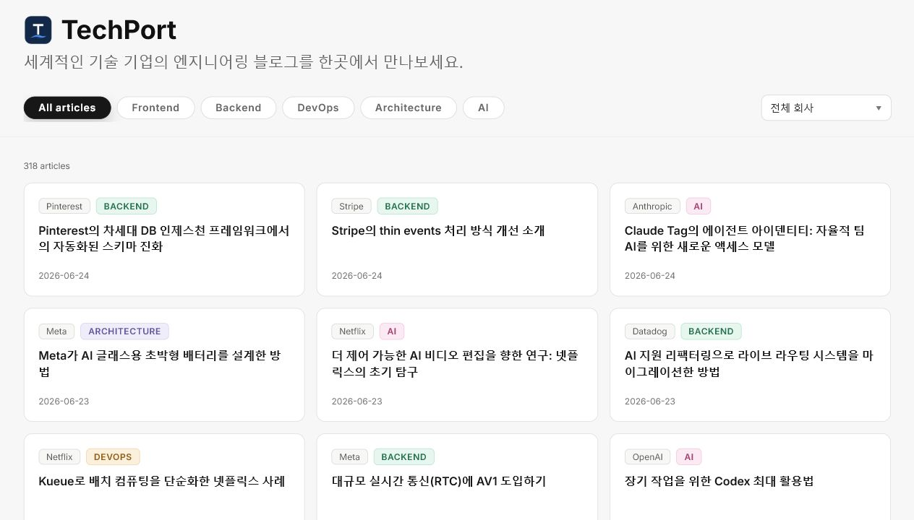
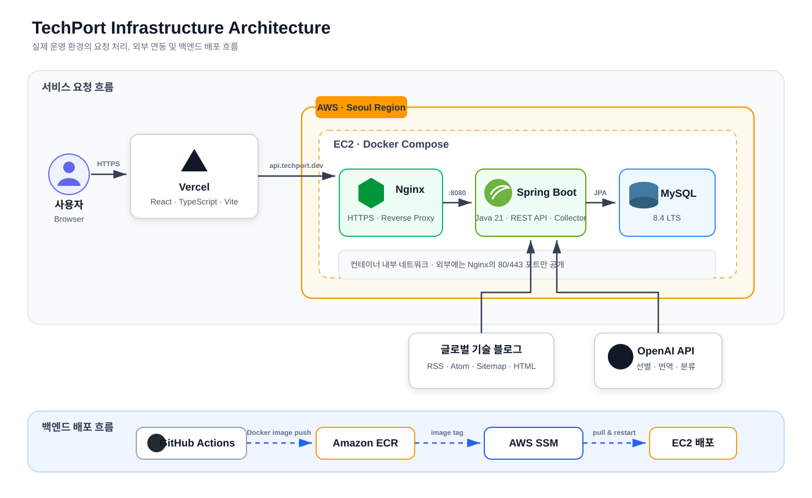

# [TechPort](https://www.techport.dev/)

> 세계적인 기술 기업의 엔지니어링 블로그를 한곳에서 만나보세요.

OpenAI, Netflix, Meta, GitHub 등 글로벌 기술 기업의 엔지니어링 아티클을
수집하고, AI로 선별·분류해 한국어 제목으로 제공하는 기술 블로그 아카이브입니다.

관심 있는 카테고리와 회사를 선택해 최신 기술 사례, 아키텍처 결정,
운영 경험을 빠르게 탐색할 수 있습니다.

<p align="center">
  <a href="https://www.techport.dev/"><strong>TechPort 바로가기 →</strong></a>
</p>



## 주요 기능

### 글로벌 기술 블로그 자동 수집

- RSS, Atom, Sitemap 및 HTML 목록 페이지에서 최신 아티클을 수집합니다.
- OpenAI, Anthropic, Netflix, Figma, Meta, Uber 등 다양한 기술 기업을 지원합니다.
- URL 해시를 기준으로 같은 회사의 중복 아티클 저장을 방지합니다.

### AI 기반 아티클 선별 및 분류

- 수집한 글이 개발자에게 유용한 기술 아티클인지 AI가 판단합니다.
- 승인된 글의 제목을 한국어로 번역합니다.
- `Frontend`, `Backend`, `DevOps`, `Architecture`, `AI` 중 하나의 카테고리로 분류합니다.
- 판단 결과를 저장해 같은 글에 대한 불필요한 AI 호출을 줄입니다.

### 관심사에 맞춘 탐색

- 카테고리와 회사별로 아티클을 필터링할 수 있습니다.
- 최신 발행일 순으로 글을 확인하고 페이지를 이동할 수 있습니다.
- 아티클 카드를 선택하면 원문 기술 블로그로 이동합니다.

## 기술 스택

| 영역 | 기술 |
| --- | --- |
| Frontend | React 19, TypeScript 5, Vite 6, Playwright |
| Backend | Java 21, Spring Boot 3.5, Spring Data JPA |
| Database | MySQL 8.4 LTS, Flyway |
| AI | OpenAI API |
| Infrastructure | AWS EC2, ECR, SSM, Docker Compose, Nginx, Let's Encrypt |
| CI/CD | GitHub Actions |
| Test | JUnit 5, Spring Boot Test, Testcontainers, Playwright |

## 아키텍처



프론트엔드는 Vercel에서 제공하고, API 요청은 AWS EC2의 Nginx를 거쳐
Spring Boot 애플리케이션으로 전달됩니다. Spring Boot와 MySQL은 동일한
EC2의 Docker Compose 내부 네트워크에서 통신하며, 외부에는 Nginx만 공개합니다.

백엔드는 GitHub Actions에서 컨테이너 이미지를 빌드해 Amazon ECR에 저장하고,
AWS SSM으로 EC2에 배포합니다. Spring Boot 수집기는 외부 기술 블로그에서
아티클을 가져와 OpenAI API의 선별·번역·분류를 거친 결과를 저장합니다.

## 프로젝트 구조

```text
global-tech-blog-archive/
├── backend/                 # Spring Boot API, 수집 및 AI 분류
│   ├── src/main/java/
│   ├── src/main/resources/  # 설정, 프롬프트, Flyway 마이그레이션
│   └── src/test/
├── frontend/                # React 웹 애플리케이션
│   ├── src/
│   └── tests/
├── deploy/                  # Nginx 및 운영 배포 문서
├── docs/                    # 아키텍처와 도메인 설계 문서
├── docker-compose.yml       # 로컬 MySQL
└── docker-compose.prod.yml  # 운영 백엔드 스택
```

